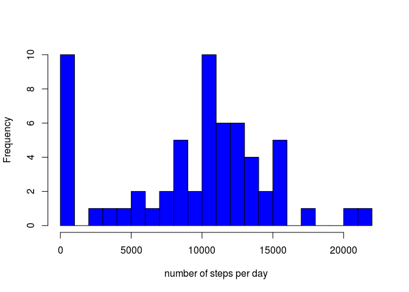
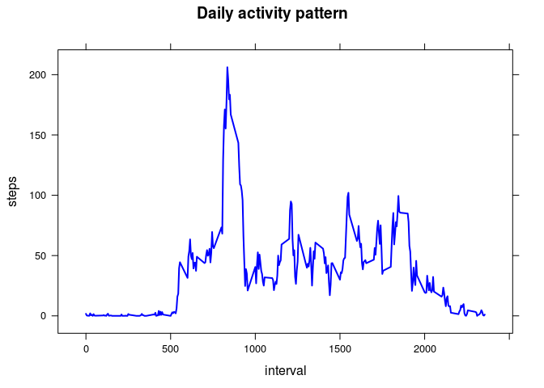
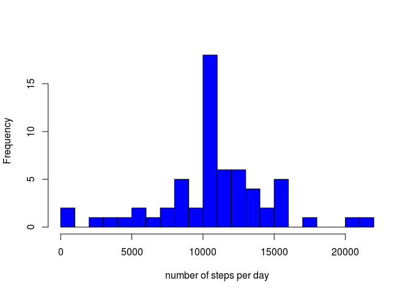
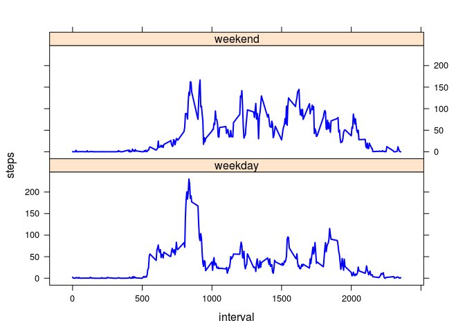

# Reproducible Research: Peer Assessment 1


**COMMENTS**     
** ** **   
Depending on your computer, executing the code will take some time. The block "filling_missing" is causing this delay. I am using Linux on a Chromebook with limited resources, so it could be that on a more powerful machine the delay is less noticable.

In order to reproduce the report the location of the source file containing the raw data obviously needs to be adepted.  
** ** **

## Loading and preprocessing the data

**1.** The data should be placed in */home/remco/Desktop/data/* folder to work.
For processing and plotting I import the *lubridate*, *dplyr* and *lattice* libraries. 


```r
library(lubridate)
library(dplyr)
```

```
## 
## Attaching package: 'dplyr'
## 
## The following objects are masked from 'package:lubridate':
## 
##     intersect, setdiff, union
## 
## The following object is masked from 'package:stats':
## 
##     filter
## 
## The following objects are masked from 'package:base':
## 
##     intersect, setdiff, setequal, union
```

```r
library(lattice)

d <- read.csv("/home/remco/Desktop/data/activity.csv")
```

Get a short overview of the data.frame to see what's in there.


```r
str(d)
```

```
## 'data.frame':	17568 obs. of  3 variables:
##  $ steps   : int  NA NA NA NA NA NA NA NA NA NA ...
##  $ date    : Factor w/ 61 levels "2012-10-01","2012-10-02",..: 1 1 1 1 1 1 1 1 1 1 ...
##  $ interval: int  0 5 10 15 20 25 30 35 40 45 ...
```

**2.** At this point no further processing of the data is required, the *date* and *interval* columns can be used in current format to create requested calculations.


## What is mean total number of steps taken per day?

**1.** Grouping over *date* value in order to calculate the total number of steps
per day, the results are stored in the *spd* (Steps Per Day) table. A histogram is created to plot the frequency (=count of days) against number of steps. 


```r
days <- group_by(d, date)
spd  <- summarize(days, steps = sum(steps, na.rm=TRUE))

hist(spd$steps, breaks=30, col="blue", xlab="number of steps per day", main="")
```

 

**2.** The mean and median value for the number of steps per day can now be calculated as follows:


```r
mean_value   <- format( mean(spd$steps, na.rm=TRUE) , nsmall=2, digits=2 )
median_value <- format( median(spd$steps, na.rm=TRUE) , nsmall=2, digits=2 )
```

It follows that  *mean_value*=9354.23 and *median_value*=10395. 


## What is the average daily activity pattern?

**1.** In order to retrieve the average daily activity pattern we need to group by *interval*, thereby summarizing over equal intervals of all recorded dates. The resulting pattern is plotted using the *xyplot* function from the *lattice* library.


```r
intervals <- group_by(d, interval)
activity  <- summarize(intervals, steps = mean(steps, na.rm=TRUE))

with(activity, xyplot( steps ~ interval, type="l", col="blue", 
                       lwd=2, main="Daily activity pattern"))
```

 

**2.** Sorting the *activity* table by *steps* (descending) will allow us to see those intervals with most steps. We will use this and show the top-3:


```r
top3 <- head( arrange( activity, -steps) , 3 )
top3
```

```
## Source: local data frame [3 x 2]
## 
##   interval    steps
## 1      835 206.1698
## 2      840 195.9245
## 3      850 183.3962
```

It follows the **maximum number of steps** occurs for interval 835 with an average of 206.1698113 steps.


## Imputing missing values


**1.** We create an overview of all the <NA> values are in the data.frame. By summing over the columns (this can be done as TRUE is evaluated to numeric 1, FALSE to 0) we see how many values are missing per column.


```r
na      <- is.na( d )
na_sum  <- apply( na , 2 , sum )
na_sum
```

```
##    steps     date interval 
##     2304        0        0
```

It follows that only the *steps* column has missing values, this should not come as a surprise as this is the only measurement! A **total number of 2304 measurements**
are missing.

**2.** Though missing values could correspond with inactivity, and therefore a count of 0 zero steps, the large number of such missing values makes it more likely they are caused by some malfunctioning of the device. In order to replace missing values with realistic values, we will use the **average number of steps for those intervals**.  

**3.** In the code below the missing *steps* values are replaced by the average number of steps for identical intervals (as calculated previously and stored in table *activity*). We will first create a new dataset, identical to the original dataset, and then fill in missing values. 


```r
d2 <- read.csv("/home/remco/Desktop/data/activity.csv")

for(i in 1:dim(d2)[1])
{
    if(is.na(d2[i,]$steps))
    {
        d2[i,]$steps <- activity[activity$interval==d2[i,]$interval,]$steps
    }
}
```

**4.** Using the new dataset *d2* we will create a histogram and calculate the mean and median number of steps taken per day. The process is identical as before, now using *d2* instead of *d*.


```r
days2 <- group_by(d2, date)
spd2  <- summarize(days2, steps = sum(steps, na.rm=TRUE))

hist(spd2$steps, breaks=30, col="blue", xlab="number of steps per day", main="")
```

 

```r
mean_value2   <- format( mean(spd2$steps, na.rm=TRUE) , nsmall=2, digits=2 )
median_value2 <- format( median(spd2$steps, na.rm=TRUE), nsmall=2, digits=2 )
```

It follows that now  *mean_value*=10766.19 and *median_value*=10766.19. 


## Are there differences in activity patterns between weekdays and weekends?


**1.** By using the *wday* function of library *lubridate* we can see what weekday a given date represents, here the value *1* and *7* correspond with respectively *Sunday* and *Saturday*. We will use this to create a factor variable *day* that can have two possible values: *weekday* and *weekend*.


```r
d2 <- mutate(d2, day = factor(1*(wday(date)==1|wday(date)==7), 
                            labels=c("weekday","weekend")))
```

**2.** Now we will make use of this newly created factor variable when we group the data by interval **and** 'daytype' (weekend/weekday). This way we create the activity pattern as before, but now we can make a distinction between the weekend and weekday pattern.


```r
day_interval <- group_by(d2, day, interval)
spd3 <- summarize(day_interval, steps = mean(steps))
```

Finally we will plot the results. As before *steps* will be plotted against *interval*, the difference is that we will plot one graph per value of the *day* factor. In other words: we will produce a plot for weekends and for weekdays.


```r
with(spd3, xyplot(steps ~ interval | day, type="l", lwd=2 , col="blue",layout=c(1,2)))
```

 

Comparing the two plots we see that for any day of the week there is very few activity in early morning and evening, as is to be expected. A typical weekend day has activity spread over the remaining hours, whereas a typical weekday show a more pronounced peak around 08:30 and again (a smaller peak) around 18:30. Probably this corresponds to activity before and after going to work.

Also it can be seen that the activity starts and peaks earlier on weekdays, as people tend/need to get up earlier on working days.


------------
